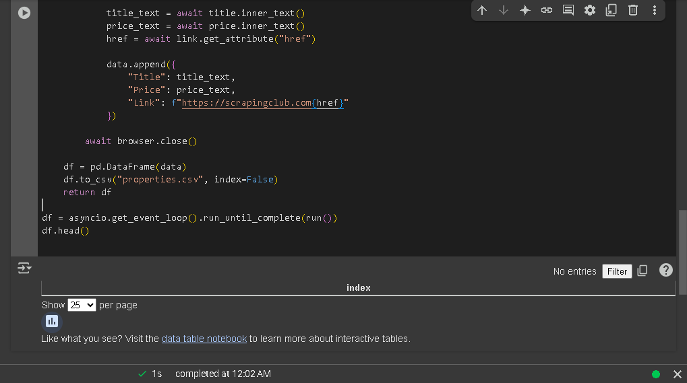

# Real Estate Scraper - Week 2

Scraper using Python + Playwright to extract property listings from a demo site.

## Tools Used
- Python
- Playwright
- pandas

## Target
[scrapingclub.com](https://scrapingclub.com/exercise/list_basic/)

## Output Example

| Title | Price |
|-------|-------|
| Short Product Description | $24.99 |

## Screenshot

---
Part of my Web Scraping learning portfolio (Week 2).
